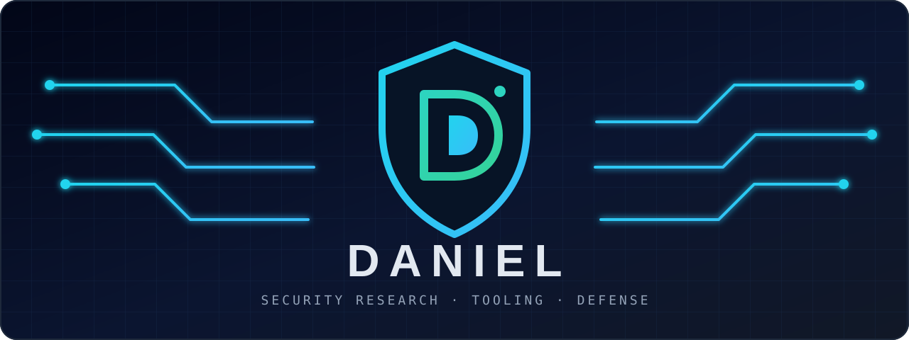

<div align="center">
  

  <h1>Daniel</h1>

  <h3>Security Research · Defensive Operations · Authorized Testing</h3>
  <p>
    
    
    
  </p>
</div>

---

```text
Building practical security tools and sharpening defensive and offensive skills
through documented research, labs, CTFs, and explicitly authorized engagements.
```

## Focus areas

<div align="center">
  
  
  
  
  
</div>

| Discipline | Capabilities |
| --- | --- |
| Development | Python, JavaScript, web programming, PowerShell |
| Security operations | SOC analysis, blue-team fundamentals, incident triage, advanced networking and security |
| Authorized testing | Red-team fundamentals; network, web, and hardware penetration testing |
| Research | OSINT, CSINT, social-engineering awareness, threat research |

> Security testing is limited to environments, systems, and scopes where authorization is explicit.

## Projects

<div align="center">
  <a href="https://github.com/Gmblos/Dribik">
    
  </a>
  <a href="https://github.com/Gmblos?tab=repositories">
    
  </a>
</div>

## Certifications

<div align="center">
  
  
</div>

## GitHub activity

<div align="center">
  
  
</div>

<div align="center">
  <sub>Learn deliberately. Test responsibly. Build tools that help make systems safer.</sub>
</div>
