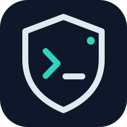

  

  # Gmblos

  **Cybersecurity learner · SOC & Network Security · Ethical Security Testing**

  

    
    
    
  

## About

I am a cybersecurity-focused developer and security practitioner interested in defensive operations, network security, threat research, and authorized penetration testing. I build practical tools, improve my technical depth, and approach security work with curiosity, documentation, and responsible disclosure in mind.

> All testing is performed only in authorized environments, labs, CTFs, or with explicit written permission.

## Core capabilities

| Area | Skills |
| --- | --- |
| Development | Python, JavaScript, web programming, PowerShell |
| Defensive security | SOC analysis, blue-team fundamentals, incident triage, advanced networking and security |
| Offensive security | Red-team fundamentals; authorized network, web, and hardware penetration testing |
| Research & intelligence | OSINT, CSINT, social-engineering awareness |
| Infrastructure | Networking, protocol analysis, security hardening |

## Certifications

- Hackvisor **CORE** Certificate
- TryHackMe **HH2026** Certificate

## Current direction

- Building security tools and automation with Python and JavaScript
- Deepening SOC workflows, log analysis, and blue-team detection skills
- Practising authorized web, network, and hardware security testing in lab environments
- Exploring threat intelligence, OSINT, and CSINT methodologies

## Selected work

Add your best repositories here. Prefer a short outcome-based description and link each project directly.

| Project | What it demonstrates | Stack |
| --- | --- | --- |
| [Dribik](https://github.com/Gmblos/Dribik) | Web penetration-testing tool. | Python · Web Security |
| [Project name](https://github.com/Gmblos/REPOSITORY) | One sentence on the lab, tool, dashboard, or research. | JavaScript · Web |
| [Project name](https://github.com/Gmblos/REPOSITORY) | One sentence on the networking or analysis result. | PowerShell · Networking |

## GitHub activity

  
  

## Contact

Replace these placeholders with the links you are comfortable sharing:

- LinkedIn: [YOUR-LINKEDIN-HANDLE](https://www.linkedin.com/in/YOUR-LINKEDIN-HANDLE/)
- Email: [YOUR-EMAIL@example.com](mailto:YOUR-EMAIL@example.com)
- TryHackMe: [YOUR-TRYHACKME-USERNAME](https://tryhackme.com/p/YOUR-TRYHACKME-USERNAME)

---

  Focused on learning, responsible practice, and making systems safer.

